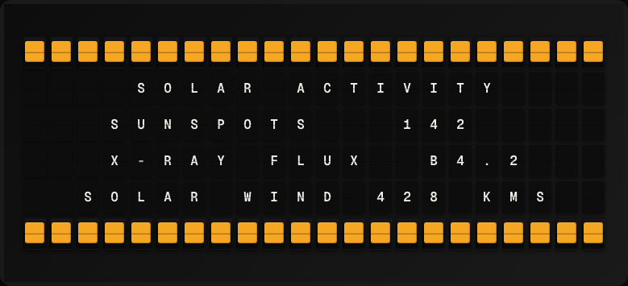

# Solar Activity Plugin

Display current sunspot count and solar flare activity from NOAA SWPC.



**→ [Setup Guide](./docs/SETUP.md)**

## Overview

The Solar Activity plugin fetches the daily solar region summary from NOAA's Space Weather Prediction Center, including the active sunspot count and the highest X-ray flux class of the day. No API key required.

## Template Variables

| Variable | Description | Example |
|---|---|---|
| `solar_activity.sunspot_count` | Number of active sunspot regions | `7` |
| `solar_activity.flare_class` | Largest solar flare class today (A/B/C/M/X) | `M1.2` |
| `solar_activity.activity_level` | Human-readable activity level | `Moderate` |

## Example Templates

```
SOLAR ACTIVITY
Sunspots: {{solar_activity.sunspot_count}}
Flare: {{solar_activity.flare_class}}
Level: {{solar_activity.activity_level}}


```

## Configuration

| Setting | Name | Description | Required |
|---|---|---|---|
| `refresh_seconds` | Refresh Interval | How often to fetch data (seconds) | No |

## Features

- Daily NOAA sunspot region count
- Largest solar flare class
- Activity level description
- No API key required

## Author

FiestaBoard Team
